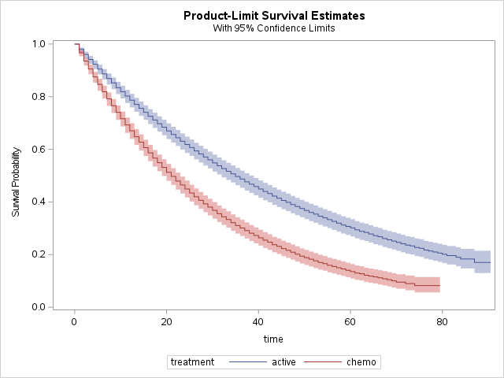

# Guyot-SAS

---

# Reconstructing individual-level data from published Kaplan-Meier survival curves using the method proposed by Guyot, Patricia et al.

---

## Code
The code in [guyot.sas](guyot.sas) implements the methods described here.

### Inputs
- `x` is a vector of x coordinates taken from a Kaplan-Meier curve
- `y` is a vector of y coordinates taken from a Kaplan-Meier curve
- `t` is a vector of timepoints `t` where the number at risk is reported
- `r` is a vector of the number at risk for each timepoint in `t`
- `tot_events` is the total number of events reported (optional)

### Outputs
The `guyot_method` module returns a matrix of individual data in rows.  The two columns are `time` and `event`.

## Requirements
Theis code requiers an installation of SAS software with the [SAS/STAT (PROC LIFETEST)](https://documentation.sas.com/?docsetId=statug&docsetTarget=statug_lifetest_overview.htm&docsetVersion=15.2&locale=en) and [SAS/IML (PROC IML)](https://documentation.sas.com/?docsetId=imlug&docsetTarget=imlug_imlstart_sect001.htm&docsetVersion=15.2&locale=en) packages, version 14.2 or higher.  

If you do not have a SAS license and want to review these methods for educational purposes, check out the free learning offering from SAS [here](https://www.sas.com/en_us/software/university-edition/download-software.html).  This free offering includes the required packages.

## Method
Guyot, P., Ades, A., Ouwens, M.J. et al. Enhanced secondary analysis of survival data: reconstructing the data from published Kaplan-Meier survival curves. BMC Med Res Methodol 12, 9 (2012). https://doi.org/10.1186/1471-2288-12-9

## Basis for this code
This code follows the R code implementation found [here](https://rdrr.io/github/certara/survivalnma/src/R/guyot.R).  The sections of this code are marked with comments containing line number ranges, which correspond to the R code implementation, making comparison easy.  Several small changes are implemented to provide error catching (for instance, avoiding divide by zero) and taking advantage of SAS/IML language features.

## Collaboration and Issues
If you discover bugs, have questions, or have an idea for a feature, then please use the issues tracking part of this repository.  

If you have made a change that you would like to share then, please make a PULL request to this repository.

## Validation
A series of code checks are currently under construction.  The author seeks a third party to assist in an unbiased review of this implementation with validation against the R implementation and the original research.  Please reach out if you would like to help with this.

## Other Methods
- Tierney, J.F., Stewart, L.A., Ghersi, D. et al. Practical methods for incorporating summary time-to-event data into meta-analysis. Trials 8, 16 (2007). [https://doi.org/10.1186/1745-6215-8-16](https://doi.org/10.1186/1745-6215-8-16)
- Parmar, M. K. B., Torri, V., & Stewart, L. (1998). Extracting summary statistics to perform meta-analyses of the published literature for survival endpoints. Statistics in Medicine, 17(24), 2815-2834. [https://doi.org/10.1002/(SICI)1097-0258(19981230)17:24<2815::AID-SIM110>3.0.CO;2-8](https://doi.org/10.1002/(SICI)1097-0258(19981230)17:24<2815::AID-SIM110>3.0.CO;2-8)
- Hoyle, M.W., Henley, W. Improved curve fits to summary survival data: application to economic evaluation of health technologies. BMC Med Res Methodol 11, 139 (2011). [https://doi.org/10.1186/1471-2288-11-139](https://doi.org/10.1186/1471-2288-11-139)

An excellent review of these methods and the Guyot method is found [here](https://www.ispor.org/docs/default-source/presentations/991.pdf?sfvrsn=192f74b0_1).

## Example
The following code runs the `guyot_method` module with created input data.  The resulting individual patient data (IPD) is then constructed into a SAS dataset with columns `time`, `event`, and `treatment`.  The SAS dataset is used to fit a survival model with PROC LIFETEST (SAS/STAT), and the resulting Kaplan-Meier fit plot is included below.

```
PROC IML;
    /* Example of Use */
        ipd_curve1 = guyot_method(0:100, exp((-1/50)*(0:100)), {0 10 50}, {1000 800 250});
        ipd_curve2 = guyot_method(0:100, exp((-1/30)*(0:100)), {0 10 50}, {1000 700 100});

        colnames={"time" "event" "treatment"};
            treat1 = j(nrow(ipd_curve1),1,'active');
            treat2 = j(nrow(ipd_curve2),1,'chemo');
        create ipd from ipd_curve1 treat1 [colname=colnames];
            append from ipd_curve1 treat1;
            append from ipd_curve2 treat2;
        close ipd;

        submit;
            ods graphics on;
                proc lifetest data=ipd plots=s(cl nocensor);
                    time time * event(0);
                    strata treatment;
                run;
            ods graphics off;
        endsubmit;
QUIT;
```

<p align="center">
  
</p>